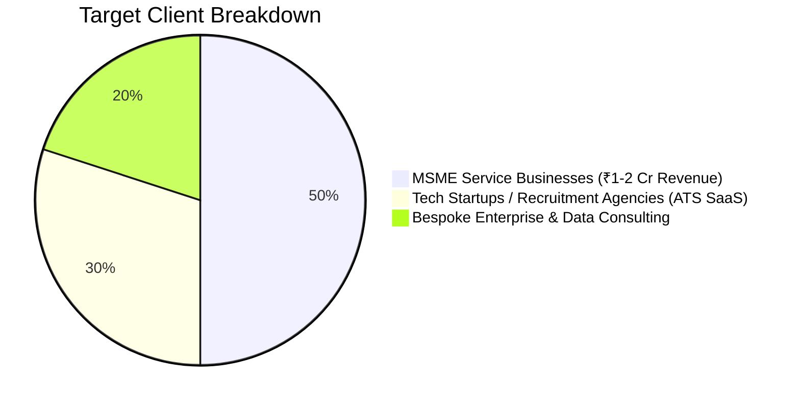
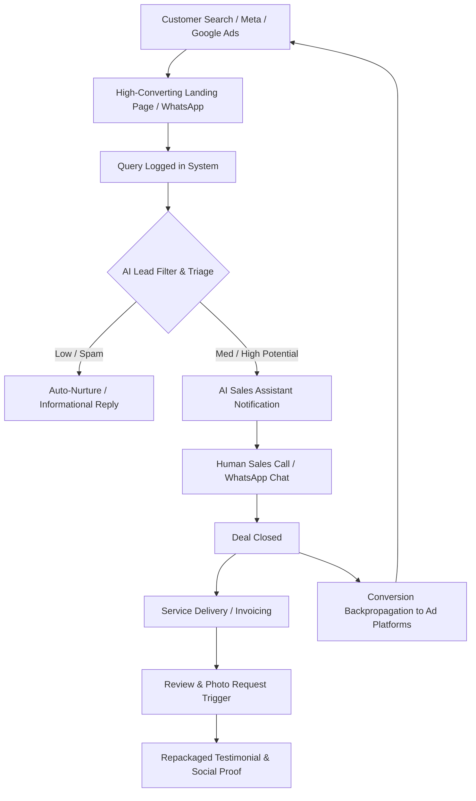

# 📜 Concept Note — ShunyaLabs Business & Operational Framework

> **Source:** Digitized, transcribed, and structured from the founding strategic notes ([`concept.pdf`](file:///Users/mrrobot/Documents/concept.pdf)).

---

## 1. Executive Summary & Market Positioning

ShunyaLabs operates as a dual-engine technology company:
1. **High-Performance Tech Consulting & SaaS Venture Studio:** Delivering custom software, AI multi-agent workflows, data pipelines, and white-label platforms to growing tech companies.
2. **MSME Digital Revenue Engine:** Digitizing offline and local service-based businesses (auto detailing, salons, healthcare, clinics, boutique retailing) with ₹1–2 Crore annual revenue to maximize their local customer acquisition and operational efficiency.

---

## 2. Target Market & Client Profile

*   **Primary Segment:** Local service-based businesses in our territory and retail service providers with ₹1–2 Crore annual turnover.
*   **Customer Pain Points:**
    *   No digital lead capture infrastructure (losing local high-intent search traffic).
    *   Unmanaged or unoptimized Google Business Profiles (GBP).
    *   Ad spend wasted due to poor lead qualification, slow response times, and lack of conversion attribution.
    *   Manual, fragmented operational management (paper-based customer logs, scattered attendance, manual invoicing).
    *   Zero automated post-service engagement or review collection.

---

## 3. Service Catalog & Offerings

### A. Digital Storefronts & Web Presence
*   **Static Company Portfolio Websites:** Fast, modern, responsive websites (built with Next.js / Tailwind CSS) designed for instant loading and high conversion rather than bloated, unmaintained web apps.
*   **Google Business Profile (GBP) Management:** End-to-end setup, category optimization, keyword enrichment, geo-tagging, regular photo posting, and Q&A management.
*   **Social & Meta Presence:** Facebook, Instagram page setup and ongoing maintenance.

### B. High-Converting Content Marketing & Creation
*   **Short-Form Video Production (Reels / Shorts):**
    *   Concept & Scripting.
    *   On-site Shooting & Directing.
    *   Professional Editing & Color Grading.
    *   Voiceover & Acting integration.
*   **Automated Social Proof & Content Packaging:**
    *   Packaging customer reviews and before/after transformation photos into branded social media posts.
    *   AI-driven automated content distribution across channels.

### C. Performance Marketing & Customer Acquisition
*   **Multi-Channel Ad Campaigns:**
    *   **Google Ads (Search & Local Services):** Targeting immediate high-intent local queries.
    *   **Meta Ads (Facebook & Instagram):** Geo-fenced creative campaigns to generate local demand.
    *   **WhatsApp Marketing:** Direct engagement, broadcast promotions, and new service announcements.
    *   **Offline Ad Synergy:** Strategy, print alignment, and QR-driven digital bridge.
*   **Outcome & Primary KPI:** Measurable, qualified **Lead Generation** and verifiable revenue increase.

---

## 4. End-to-End Lead Funneling Architecture

### Key Funnel Mechanisms:
1. **Lead Filter (KPI):** Transforming unstructured queries into categorized, high-intent leads (`Query` $\rightarrow$ `Lead`).
2. **Lead Data Recording:** Centralized ingestion via App Entry, Google Sheets sync, or Super Admin portal.
3. **Commission-Based Conversion Tracking:** Tracking closed deals with revenue attribution to prove ROI.
4. **Ad Platform Backpropagation:** Sending verified offline/online conversion events back to Google & Meta Ads to train bidding algorithms for higher quality traffic.
5. **Continuous Lead Nurturing:** Keeping existing customers actively engaged through seasonal promotions, broadcast announcements, and lifecycle reminders.

---

## 5. Operations & CRM Architecture

### A. Core Operational Modules
*   **Customer & Service Ledger:** Instant customer check-in, service selection, job card generation, and PDF invoicing.
*   **Business Operations & Expense Tracker:** Recording daily business expenses, vendor costs, and generating profitability analytics.
*   **Staff & Attendance Management:** Employee attendance logging, salary calculation, advance tracking, and digital receipt generation.
*   **Analytics Dashboard:** Visual tracking of revenue per service, customer lifetime value (LTV), staff productivity, and profit margins.

### B. WhatsApp Business & Conversational AI Integration
*   **Customer Query Logger:** Automatically captures incoming inquiries from WhatsApp.
*   **Human-Like AI Assistant:**
    *   Instant intelligent auto-replies with conversational tone.
    *   Customer profiling & sentiment analysis.
    *   Equips the sales executive with contextual insights and upselling recommendations prior to calling.
    *   Conversation prioritization scoring: `High`, `Medium`, `Low` intent.
*   **Post-Service Engagement Loop:**
    *   Automated review and feedback request triggers post-service.
    *   Collection of customer photos and ratings for Google & Instagram social proof.

### C. Tri-Layer Data Entry System
1. **Google Sheets Integration:** Zero-friction entry point for non-technical client staff.
2. **Dedicated Mobile/Web App Entry:** Structured forms for fast on-the-ground operational logging.
3. **Super Admin Dashboard:** Master controls, permissions, cross-client analytics, and audit logs.

---

## 6. People & Workforce Skill Enablement

*   **Frontline Staff Training Program (₹25,000 – ₹30,000 package):**
    *   Training local business staff on digital app usage, lead logging, and data hygiene.
    *   Standard operating procedures (SOPs) for high-quality photo capture and customer consent collection.
    *   Customer communication etiquette on WhatsApp and phone follow-ups.
