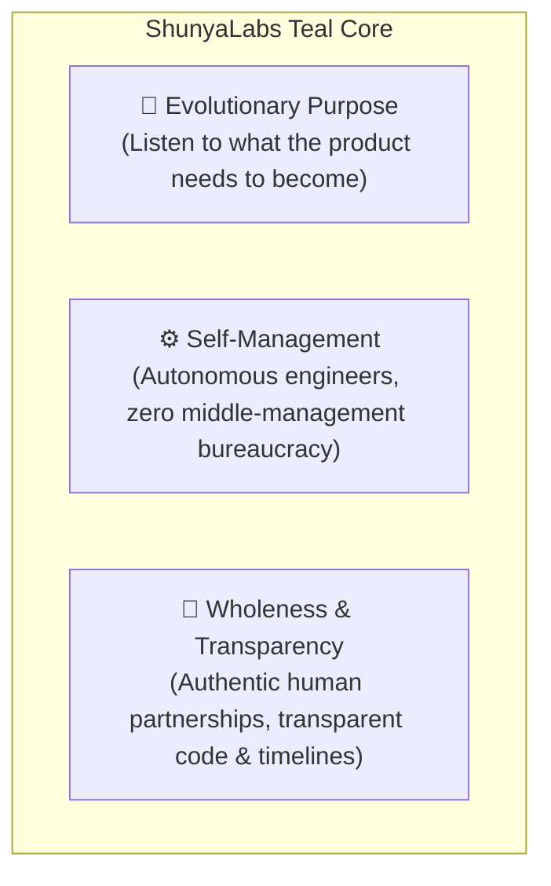
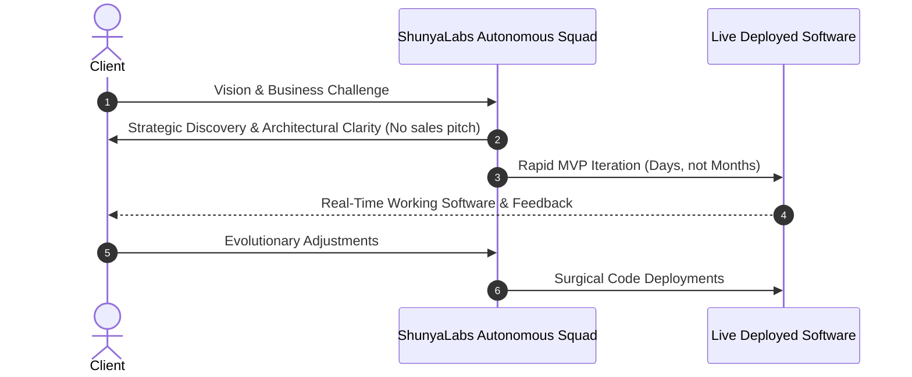

# 🌿 Teal Organization Philosophy — ShunyaLabs Operating System

> *"An organization is not a machine to be controlled, but a living ecosystem with an evolutionary purpose."*  
> — Inspired by Frederic Laloux (*Reinventing Organizations*)

---

## 1. What is a Teal Organization?

In human organizational history, management models have evolved through distinct stages:
*   **🔴 Red (Impulsive):** Rule by fear and raw authority (e.g., street gangs, warlords).
*   **🟠 Amber (Conformist):** Rigid hierarchy, stability, strict processes (e.g., traditional military, government bureaucracy).
*   **🟡 Orange (Achievement):** Meritocracy, goal-driven, profit maximization, machine metaphor (e.g., Wall Street, modern big tech corporations).
*   **🟢 Green (Pluralistic):** Culture-driven, empowerment, consensus, stakeholder values (e.g., non-profits, Starbucks, Southwest Airlines).
*   **🌐 Teal (Evolutionary):** Complex living organism, self-management, wholeness, evolutionary purpose (e.g., Buurtzorg, Valve, Patagonia, Morning Star, Enspiral).

**ShunyaLabs operates as a Teal Technology Studio and SaaS Venture Incubator.**

---

## 2. The Three Foundational Pillars of ShunyaLabs

### Pillar 1: Evolutionary Purpose (Building What Matters)
*   **Traditional Consulting (Orange):** Treat contracts like rigid machines. If a client needs a feature change, bill extra change requests, maximize developer hours, and ship features that nobody uses.
*   **ShunyaLabs (Teal):** We actively listen to the product's market signal. If user feedback or data demonstrates that a feature in the original spec will not generate value, we adapt our engineering strategy immediately. We build software that naturally thrives in the real world.

### Pillar 2: Self-Management (Zero Bureaucracy)
*   **Traditional Consulting (Orange):** Multi-layered management hierarchies: Account Executive $\rightarrow$ Project Manager $\rightarrow$ Engineering Lead $\rightarrow$ Junior Developer. The client’s intent is lost in translation.
*   **ShunyaLabs (Teal):** Direct peer-to-peer collaboration. Clients work directly with autonomous, senior-level engineers and strategists who have the agency and authority to make technical and design decisions on the fly. No fluff, no "telephone game."

### Pillar 3: Wholeness & Radical Transparency
*   **Traditional Consulting (Orange):** Polished corporate facades, hiding bugs behind PR speak, artificial status decks.
*   **ShunyaLabs (Teal):** We operate with complete authentic transparency. Our clients see our real Git repositories, live deployment pipelines, honest timelines, and straightforward trade-off discussions. We build long-term trust through absolute competence and honesty.

---

## 3. Organizational Inspirations & Case Studies

| Organization | Key Practice | How ShunyaLabs Applies It |
| :--- | :--- | :--- |
| **Valve Software** | Flat structure, extreme autonomy, mobility of talent based on high-impact projects. | Engineers choose the highest-leverage problems to solve across client projects and internal SaaS products. |
| **Enspiral** | A collective of autonomous freelancers and software artisans who pool resources and knowledge. | High-caliber independent practitioners uniting under a unified brand to deliver world-class software. |
| **Buurtzorg** | 10,000+ nurses working in small, autonomous, self-managing teams of 10–12 with zero central middle management. | Lightweight, modular project squads that own an entire product lifecycle from architecture to production launch. |
| **Patagonia** | Purpose-driven stewardship; making products built to endure rather than planned obsolescence. | Clean, maintainable, modular software codebases built with modern standards (FastAPI, Next.js, TypeScript, Docker) that clients can maintain effortlessly. |
| **Morning Star** | Direct peer agreements (CLOU - Colleague Letters of Understanding) rather than top-down mandates. | Clear mutual accountability between team members and direct commitments to client outcomes. |

---

## 4. Teal in Client Engagements: The "Anti-Agency" Promise

When a client partners with ShunyaLabs, they experience a fundamentally different dynamic:

1. **You Speak with the Builders:** No non-technical account managers making promises they can't engineer.
2. **Complete IP & Code Ownership:** We build clean, well-documented code that belongs 100% to the client.
3. **Speed Over Ceremony:** We value working software, automated tests, and live preview URLs over 50-page PowerPoint status decks.
4. **Shared Success Mindset:** We treat our clients' capital with the same discipline and efficiency as our own.
