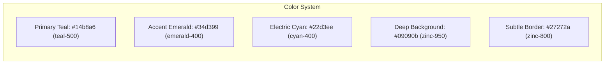
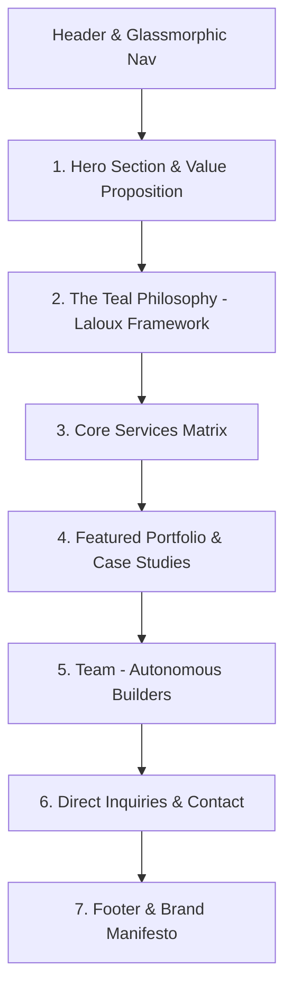
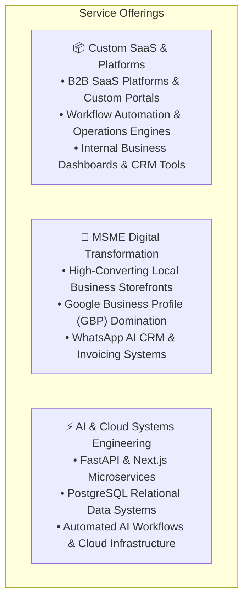
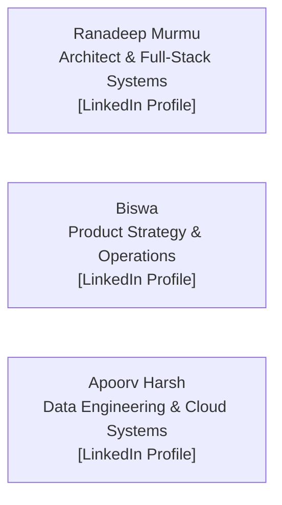

# 🎨 ShunyaLabs Static Website — Design, UI/UX & Wireframe Blueprint

> **Tech Stack:** Next.js 14/15 (App Router) + TypeScript + Tailwind CSS + shadcn/ui + Lucide Icons + Framer Motion.  
> **Visual Identity:** Modern Dark Theme with Organic Teal & Emerald Accents, Frosted Glassmorphism, and Human-Centric Minimalism.

---

## 1. Design System & Visual Identity Tokens

### Visual Styling Guidelines
1. **The Palette:**
   *   **Background:** Deep Organic Dark `zinc-950` (`#09090b`) and `slate-900` (`#0f172a`) — avoids harsh pure pitch black for a warmer, more human environment.
   *   **Brand Primary:** `teal-500` (`#14b8a6`) and `teal-400` (`#2dd4bf`) — symbolizes clarity, communication, and vitality.
   *   **Accents & Gradients:** `emerald-400` $\rightarrow$ `teal-500` $\rightarrow$ `cyan-400` gradients on headings and badges.
2. **Organic Shapes & Glassmorphism:**
   *   Smooth, organic corner radii (`rounded-2xl` / `rounded-3xl`).
   *   Frosted glass navigation and cards (`backdrop-blur-md bg-zinc-900/60 border border-zinc-800/80`).
3. **Typography:**
   *   **Headings:** *Geist Sans* / *Plus Jakarta Sans* (bold, modern, architectural).
   *   **Body:** *Inter* (high legibility, neutral, unpretentious).
   *   **Code & Metrics:** *JetBrains Mono* or *Geist Mono*.
4. **Authenticity Rule:**
   *   **Strictly Zero Stock Photography:** No generic business suits or fake handshakes. All visuals feature actual project screenshots ([KaizenCodes](https://dev.kaizencodes.com), [Hopping Cars](https://hoppingcars.com)), real code snippets, architecture diagrams, and real team profiles.

---

## 2. Complete Page Structure & Wireframe

---

### Section 1: Navigation Bar (Sticky Frosted Header)
*   **Brand Mark:** `ShunyaLabs` (with a glowing emerald/teal glyph `[ 0 ]`).
*   **Nav Links:** `Philosophy`, `Services`, `Work`, `Team`, `About`.
*   **Primary CTA Button:** `Start a Project` $\rightarrow$ smooth scrolls to inquiry section or opens WhatsApp.

---

### Section 2: Hero Section (The Hook)
*   **Badge:** `🌿 Powered by Teal Engineering & Scalable Systems`
*   **Main Headline:**
    > **Engineering Scalable SaaS, AI, and Data Systems.**
*   **Sub-Headline:**
    > ShunyaLabs is a Teal-inspired technology studio. We partner with fast-growing startups and local enterprises to build high-converting web presences, intelligent automated workflows, and robust data architectures.
*   **Interactive CTAs:**
    *   `Primary Button (Teal Glow):` **Start a Project $\rightarrow$**
    *   `Secondary Button (Ghost Outline):` **Explore Case Studies**
*   **Live Metrics Ticker:**
    *   `100% Direct Engineer Access` • `0% Middle-Management Overhead` • `Modern Next.js & FastAPI Architecture`

---

### Section 3: Our Philosophy (The Teal Approach)
*Headline: "How We Build: The Teal Operating Model"*

| Pillar Card | Visual Icon | Core Narrative |
| :--- | :---: | :--- |
| **🌱 Evolutionary Purpose** | `Sparkles` | We don't blindly execute rigid spec sheets to pad billable hours. We listen to what the product and market naturally demand, adapting technical strategies to ensure real-world success. |
| **⚙️ Self-Management** | `Cpu` | Zero bureaucratic account managers or middlemen. You work directly with senior autonomous engineers who possess full decision-making authority. |
| **🤝 Wholeness & Radical Transparency** | `ShieldCheck` | Honest timelines, transparent Git repositories, direct trade-off discussions, and complete client ownership of code and infrastructure. |

---

### Section 4: Services Matrix (What We Do)
*Headline: "Bespoke Engineering for Modern Growth"*

---

### Section 5: Featured Portfolio & Proven Impact

#### Card A: [Hopping Cars](https://hoppingcars.com/car-painting-begur-bangalore.html) (MSME Transformation)
*   **Category:** Local Business Growth Engine & Lead Generation
*   **Highlights:** High-conversion localized service landing page, Google Ads & Local SEO integration, direct customer capture pipeline, and verifiable local market authority.
*   **Key Results:** 3x increase in direct phone & WhatsApp leads, fast page load speeds under 800ms.

#### Card B: [KaizenCodes](https://dev.kaizencodes.com) (Enterprise SaaS & AI Learning)
*   **Category:** AI Engineering, Cloud Data Systems & Developer Platform
*   **Highlights:** Full-stack Next.js/FastAPI platform featuring automated code evaluation, real-time Markdown Studio with live Mermaid rendering, and resilient multi-agent architecture.
*   **Key Results:** Production-grade developer ecosystem with robust test coverage (Pytest + Vitest + Playwright).

---

### Section 6: The Team (Autonomous Builders & Strategists)

*Headline: "Built by Autonomous Practitioners, Not Salespeople"*

*   **[Ranadeep Murmu](https://www.linkedin.com/in/ranadeep-murmu/):** Full-stack system architecture, Next.js/FastAPI web platforms, AI multi-agent workflows.
*   **[Biswa](https://www.linkedin.com/in/biswa-isdm/):** Product strategy, business systems, MSME operational scaling.
*   **[Apoorv Harsh](https://www.linkedin.com/in/apoorv-harsh-aa8671126/):** Data architecture, backend infrastructure, high-throughput cloud pipelines.

---

### Section 7: Direct Inquiries & Contact
*   **Direct Inquiry Card:** Clean form (Name, Work Email, Project Type, Estimated Budget, Project Overview).
*   **Fast Track Option:** One-click `Chat on WhatsApp` link for rapid founder-to-engineer triage.
*   **Commitment:** *Guaranteed response within 4 hours directly from an engineering lead.*

---

### Section 8: Footer
*   **Logo & Ethos:** *ShunyaLabs — From zero to infinite possibilities.*
*   **Quick Links:** Docs, Portfolio, GitHub, Terms, Privacy.
*   **Copyright:** © 2026 ShunyaLabs. Built with Next.js, Tailwind CSS, and Teal Principles.
