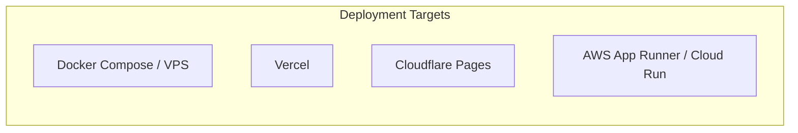

# 🏗️ Engineering Architecture & Tech Stack Strategy

> **Core Philosophy:** Simplicity First, Surgical Modularity, High Performance, and Frictionless Multi-Cloud Portability.

---

## 1. Unified Technology Stack

```mermaid
graph TD
    subgraph "Client Tier (Consulting Platform)"
        FE1[Next.js 14 App Router]
        FE2[TypeScript & React Server Components]
        FE3[Tailwind CSS & Glassmorphism UI]
        FE4[Lucide React Icons]
    end

    subgraph "Edge & API Layer"
        API1[Next.js Serverless API Routes]
        API2[Contact Intake & Rate Limiting]
        API3[WhatsApp Direct Connect Handshake]
    end

    subgraph "Deployment & Containerization"
        D1[Docker Alpine Container]
        D2[Docker Compose Orchestration]
        D3[Multi-Cloud Edge Deployment]
    end

    Client Tier -->|REST / Form Intake| Edge & API Layer
    Edge & API Layer --> Deployment & Containerization
```

---

## 2. Technology Selection Rationale

| Layer | Technology | Decision Rationale & Advantages |
| :--- | :--- | :--- |
| **Frontend Framework** | **Next.js 14 (App Router)** | Instant static page rendering for search indexing, zero hydration latency, and optimal Core Web Vitals. |
| **Styling & UI** | **Tailwind CSS** | Atomic CSS utility system with custom Teal branding tokens and glassmorphism styling. |
| **Type Safety** | **TypeScript 5.x** | Strict compile-time safety across all client and server components. |
| **Containerization** | **Docker (Node 22 Alpine)** | Predictable, lightweight production build with single-command local and cloud portability. |

---

## 3. ShunyaLabs Multi-Cloud Deployment Matrix

The application is engineered to deploy seamlessly to any modern cloud infrastructure with zero lock-in:



### Production Docker Blueprint

```dockerfile
FROM node:22-alpine AS base
RUN npm install -g pnpm@11.7.0
WORKDIR /app
COPY package.json pnpm-lock.yaml* ./
RUN pnpm install
COPY . .
ENV NODE_ENV=production
RUN pnpm build
EXPOSE 3000
CMD ["pnpm", "start"]
```
