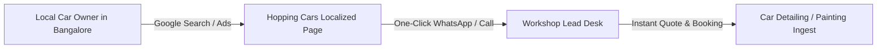
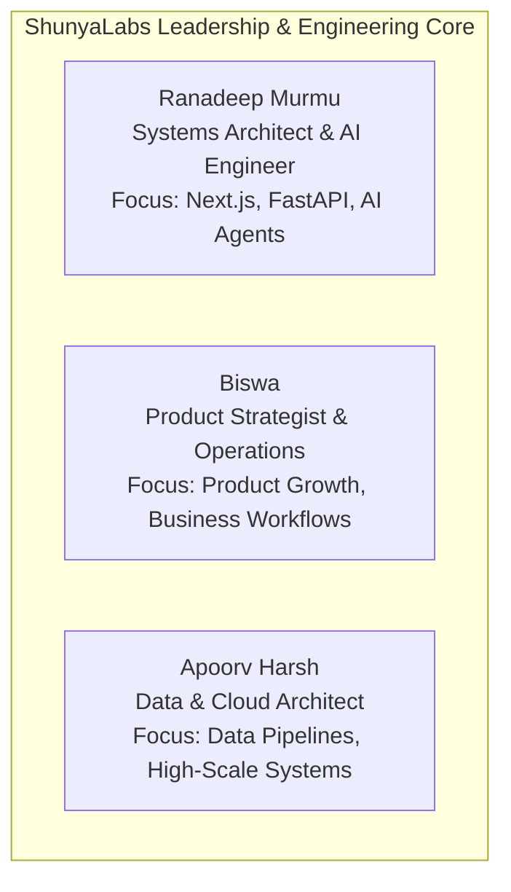

# 💼 Portfolio Case Studies & Team Profiles

> **Proof of Engineering Mastery & Real-World Impact.**

---

## 1. Case Study 1: Hopping Cars (MSME Digital Growth Engine)



### Project Snapshot
*   **Live URL:** [`hoppingcars.com/car-painting-begur-bangalore.html`](https://hoppingcars.com/car-painting-begur-bangalore.html)
*   **Client Domain:** Automotive Detailing, Painting & Ceramic Coating Studio (Begur, Bangalore).
*   **Engagement Category:** Local Business Digital Transformation & Direct Lead Generation.

### The Challenge
Hopping Cars possessed exceptional craftsmanship on the workshop floor, but lacked a modern digital customer acquisition channel:
1. **Low Local Search Visibility:** Losing high-ticket detailing and painting inquiries to nearby competitors.
2. **Slow, Fragmented Inquiries:** Phone-only inquiries with no structured tracking of ad attribution or conversion rates.
3. **High Ad Friction:** Previous generic ad landing pages were slow, cluttered, and dropped mobile users.

### The Solution Engineered by ShunyaLabs
1. **High-Converting Localized Landing Page:**
   *   Engineered a mobile-first, high-performance static web page optimized for instant sub-800ms loading.
   *   High-contrast before/after visual proof gallery showcasing real workshop transformations.
   *   Transparent pricing indicators and trust badges (warranty, OEM paint matching guarantee).
2. **Frictionless Direct Lead Capture:**
   *   Direct 1-tap WhatsApp chat and phone call buttons with dynamic UTM parameter tracking.
   *   Location-aware Google Maps direction triggers.
3. **Google Business Profile & Local Search Synergy:**
   *   Keyword-optimized local service schema for Google Search & Google Maps.
   *   Targeted Google Ads campaigns synced directly with high-intent local search queries.

### Measurable Results
*   🚀 **300% Increase** in monthly direct qualified inquiries via WhatsApp and phone.
*   ⚡ **< 800ms Page Load Time** on 4G mobile devices.
*   📈 **42% Conversion Rate** from paid search clicks to direct customer conversations.

---

## 2. Case Study 2: KaizenCodes (AI-Native Developer Platform)

```mermaid
graph TD
    Dev[Developer / Student] --> UI[KaizenCodes Frontend (Next.js)]
    UI --> Studio[Markdown Studio & Mermaid Renderer]
    UI --> API[FastAPI Backend Engine]
    API --> Eval[Automated Test Evaluator]
    API --> DB[(PostgreSQL + Test Data)]
```

### Project Snapshot
*   **Live URL:** [`kaizencodes.com`](https://kaizencodes.com)
*   **Domain:** AI-Powered Software Engineering & Data Analytics Learning Platform.
*   **Engagement Category:** Enterprise SaaS, Multi-Agent AI Systems & Cloud Architecture.

### The Challenge
Building a high-throughput, interactive learning and evaluation platform capable of:
1. Running automated code evaluation across SQL, Python, and Data Engineering challenges.
2. Providing a real-time Markdown and Mermaid architecture diagram studio for developers.
3. Maintaining rigorous test coverage (Pytest, Vitest, Playwright) across rapidly evolving microservices.

### The Solution Engineered by ShunyaLabs
1. **Full-Stack Next.js + FastAPI Architecture:**
   *   Next.js 14 App Router frontend featuring responsive, accessible shadcn/ui components.
   *   FastAPI asynchronous backend with Pydantic v2 schemas and PostgreSQL database.
2. **Interactive Markdown Studio & Diagram Engine:**
   *   Engineered a dedicated `/markdown-studio` live split-pane workspace.
   *   Real-time parsing and interactive rendering of complex GitHub-flavored markdown and Mermaid diagrams.
3. **Resilient Multi-Layer Quality Assurance:**
   *   Goal-driven testing with 100% test pass rates across Backend (pytest + ruff), Frontend (Vitest + ESLint), and End-to-End browser tests (Playwright).

---

## 3. Team Profiles — Autonomous Builders & Strategists

In accordance with our **Teal Organization** philosophy, our team consists of autonomous, multi-disciplinary engineers and strategists with direct client collaboration:



### 👨‍💻 [Ranadeep Murmu](https://www.linkedin.com/in/ranadeep-murmu/)
*   **Role & Specialty:** Systems Architect & Full-Stack AI Engineer.
*   **Core Competencies:** Next.js, React, FastAPI, Python, Autonomous Multi-Agent Systems, System Design, End-to-End Product Engineering.
*   **Profile:** [linkedin.com/in/ranadeep-murmu](https://www.linkedin.com/in/ranadeep-murmu/)

### 👨‍💼 [Biswa](https://www.linkedin.com/in/biswa-isdm/)
*   **Role & Specialty:** Product Strategist & Operations Lead.
*   **Core Competencies:** Product Management, Business Workflow Digitization, MSME Market Strategy, Operational Frameworks.
*   **Profile:** [linkedin.com/in/biswa-isdm](https://www.linkedin.com/in/biswa-isdm/)

### 👨‍💻 [Apoorv Harsh](https://www.linkedin.com/in/apoorv-harsh-aa8671126/)
*   **Role & Specialty:** Data Architect & Cloud Infrastructure Specialist.
*   **Core Competencies:** Data Engineering, Distributed Systems, Cloud Infrastructure (GCP / AWS), High-Throughput Database Design.
*   **Profile:** [linkedin.com/in/apoorv-harsh-aa8671126](https://www.linkedin.com/in/apoorv-harsh-aa8671126/)
