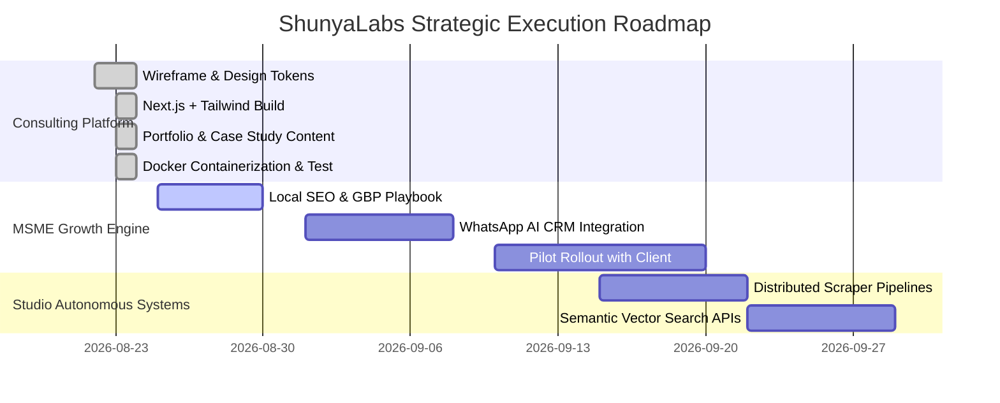

# 🗺️ Project Roadmap, Sprints & Execution Milestones

> **A Strategic Step-by-Step Blueprint for ShunyaLabs Consulting Platform & Studio Offerings.**

---

## 1. High-Level Master Roadmap

---

## 2. Detailed Task Breakdown & Sprints

### 🟢 Track 1: ShunyaLabs Company Consulting Website
*   [x] **Design & Architecture Blueprint:** Finalize wireframe, Teal design system tokens, and page hierarchy.
*   [x] **Codebase Implementation:**
    *   Next.js 14 App Router with TypeScript and Tailwind CSS.
    *   `Navbar.tsx`: Sticky frosted glass navigation with brand glyph `[ 0 ]`.
    *   `Hero.tsx`: High-converting headline, badge, call-to-actions, and live terminal ticker.
    *   `Philosophy.tsx`: Interactive cards for Laloux's Teal Organization principles.
    *   `Services.tsx`: 3-column service offerings grid.
    *   `Portfolio.tsx`: Case study cards featuring [Hopping Cars](https://hoppingcars.com/car-painting-begur-bangalore.html) and [KaizenCodes](https://dev.kaizencodes.com).
    *   `Team.tsx`: Bio cards with direct LinkedIn links for Ranadeep, Biswa, and Apoorv.
    *   `Contact.tsx`: Interactive inquiry form with direct WhatsApp click-to-chat fallback.
    *   `Footer.tsx`: Studio manifesto and ecosystem links.
*   [x] **Docker Containerization:** Optimized `Dockerfile` and `docker-compose.yml` for single-command launch.

---

### 🟡 Track 2: MSME Digitization Engine
*   [x] **Strategy & Local GBP Playbook:** Local search cluster architecture (proven via Hopping Cars).
*   [ ] **WhatsApp Cloud API Integration:** Automated AI qualification funnel and instant chat lead capture.
*   [ ] **Client Onboarding & Pilot Rollout:** Turnkey deployment for Bangalore automotive/retail MSMEs.

---

### 🟣 Track 3: Autonomous AI & Studio Systems
*   [x] **KaizenCodes Intelligence Platform:** Production developer learning and interview prep SaaS.
*   [ ] **Automated Operations & Workflow SaaS Engine:** Custom multi-tenant client operations and business reporting portals.
